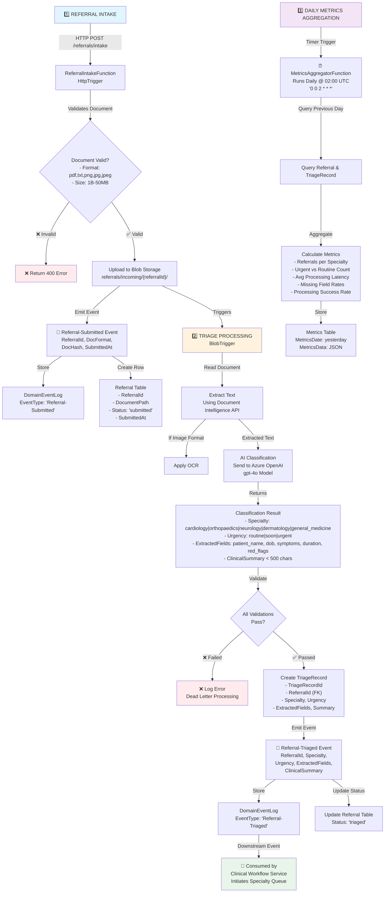

# Referral Triage: Event Flow & Infrastructure Requirements

## Executive Summary

The referral-triage system is an **event-driven pipeline** that processes referral documents through three distinct phases:
1. **Intake & Validation** → Referral submission and document storage
2. **AI Triage & Classification** → Document analysis and clinical categorization
3. **Metrics Aggregation** → Daily reporting and analytics

---

## � Visual Architecture Diagram



---

## �🔄 Step-by-Step Event Flow

### Phase 1: REFERRAL INTAKE (HTTP-Triggered)

#### Flow:
```
Clinical Coordinator
    ↓
[HTTP POST /referrals/intake]
    ↓
ReferralIntakeFunction
    ├─ Validates document format (pdf, txt, png, jpg, jpeg)
    ├─ Validates document size (1 byte - 50 MB)
    ├─ Generates unique ReferralId (GUID)
    ├─ Computes DocumentHash (SHA-256)
    ├─ Uploads to Blob Storage: referrals/incoming/{referralId}/{fileName}
    ├─ Creates Referral record in SQL DB with status='submitted'
    ├─ Emits: Referral-Submitted event
    ├─ Logs event to DomainEventLog
    ├─ Returns: ReferralId to caller (200 OK)
    └─ **TRIGGERS** → Phase 2
```

#### Domain Event: `Referral-Submitted`
**Payload:**
```json
{
  "ReferralId": "uuid-xxxx",
  "DocumentFormat": "pdf",
  "DocumentHash": "sha256-hash",
  "DocumentSize": 245000,
  "SubmittedAt": "2026-03-17T14:30:00Z",
  "SubmittedBy": "coordinator@clinic.com"
}
```

#### Database Impact:
- **Table: Referral**
  - ReferralId (PK)
  - DocumentFormat
  - DocumentSize
  - DocumentStoragePath: `referrals/incoming/{referralId}/document.pdf`
  - DocumentHash
  - Status: `'submitted'`
  - SubmittedBy
  - SubmittedAt
  - CreatedAt

- **Table: DomainEventLog**
  - DomainEventId (PK)
  - EventType: `'Referral-Submitted'`
  - ReferralId (FK)
  - Payload: JSON serialized event data
  - CreatedAt

#### Success Criteria:
✅ Document stored in correct Blob path
✅ Referral record created with unique ID
✅ Event logged to DomainEventLog
✅ Caller receives 200 response with ReferralId

---

### Phase 2: TRIAGE PROCESSING (Blob-Triggered)

#### Flow:
```
Blob Storage Event (new file uploaded)
    ↓
TriageProcessorFunction
    ├─ Triggers on: referrals/incoming/{referralId}/{fileName}
    ├─ Retrieves blob stream from Blob Storage
    ├─ Determines document format from file extension
    │
    ├─ TEXT EXTRACTION:
    │  └─ If format = pdf|txt:
    │      └─ Read text directly
    │  └─ If format = png|jpg|jpeg:
    │      └─ Call: Azure Document Intelligence API → OCR
    │             ↓ (Extracts text + metadata + confidence scores)
    │
    ├─ AI CLASSIFICATION:
    │  └─ Send extracted text to: Azure OpenAI (gpt-4o)
    │     Prompt: Classify specialty, urgency, extract key clinical fields, generate summary
    │             ↓
    │             Returns: JSON with:
    │             - specialty ∈ {cardiology, orthopaedics, neurology, dermatology, general_medicine}
    │             - urgency ∈ {routine, soon, urgent}
    │             - extractedFields: {patient_name, dob, symptoms, duration, red_flags}
    │             - clinicalSummary (< 500 chars)
    │
    ├─ VALIDATION:
    │  ├─ Specialty in allowed set? → TriageRecord-SpecialtyInvariant
    │  ├─ Urgency in allowed set? → TriageRecord-UrgencyInvariant
    │  ├─ All required fields present & non-empty? → TriageRecord-KeyFieldsInvariant
    │  └─ clinicalSummary < 500 chars? → TriageRecord-ClinicalSummaryInvariant
    │
    ├─ SUCCESS PATH:
    │  ├─ Create TriageRecord in SQL DB
    │  ├─ Emits: Referral-Triaged event
    │  ├─ Logs event to DomainEventLog
    │  ├─ Update Referral.Status = 'triaged'
    │  └─ **PROPAGATES** → Clinical Workflow Service (event bus/queue)
    │
    └─ FAILURE PATH:
       ├─ Log error with ReferralId and validation failure reason
       ├─ Referral.Status = 'triage_failed'
       ├─ Create ErrorLog entry
       └─ Dead-letter for manual review
```

#### Domain Event: `Referral-Triaged`
**Payload:**
```json
{
  "ReferralId": "uuid-xxxx",
  "TriageRecordId": "uuid-yyyy",
  "Specialty": "cardiology",
  "Urgency": "urgent",
  "ExtractedFields": {
    "patient_name": "John Doe",
    "dob": "1980-05-15",
    "symptoms": "Chest pain, shortness of breath",
    "duration": "3 weeks",
    "red_flags": "Persistent symptoms despite rest"
  },
  "ClinicalSummary": "Patient with 3-week chest pain, stable vitals, requires cardiology evaluation within 24 hours",
  "TriagedAt": "2026-03-17T14:32:15Z"
}
```

#### Database Impact:
- **Table: TriageRecord**
  - TriageRecordId (PK)
  - ReferralId (FK) → Referral.ReferralId
  - Specialty: `'cardiology'`
  - Urgency: `'urgent'`
  - ExtractedFields: JSON
  - ClinicalSummary: text
  - CreatedAt
  - TriagedAt
  - ModifiedAt

- **Table: Referral** (updated)
  - Status: `'triaged'` (from `'submitted'`)
  - ModifiedAt

- **Table: DomainEventLog** (new entry)
  - EventType: `'Referral-Triaged'`
  - ReferralId (FK)
  - Payload: JSON serialized event data

#### External API Calls:
| Service | Purpose | Config Key |
|---------|---------|-----------|
| Azure Document Intelligence | Text extraction via OCR | `DocumentIntelligenceEndpoint`, `DocumentIntelligenceKey` |
| Azure OpenAI (gpt-4o) | AI classification & summarization | `AzureOpenAiEndpoint`, `AzureOpenAiKey`, `AzureOpenAiDeploymentName` |

#### Success Criteria:
✅ Document text extracted successfully
✅ AI classification received and parsed
✅ All triage result validations pass
✅ TriageRecord persisted to database
✅ Referral-Triaged event emitted and logged
✅ Downstream systems notified via event

---

### Phase 3: DAILY METRICS AGGREGATION (Timer-Triggered)

#### Flow:
```
Timer Trigger (Daily @ 02:00 UTC)
    ↓
MetricsAggregatorFunction
    ├─ Trigger Schedule: '0 0 2 * * *' (CRON format)
    ├─ Calculates metricsDate = Yesterday (UTC)
    │
    ├─ QUERY PREVIOUS DAY DATA:
    │  └─ FROM Referral WHERE SubmittedAt >= metricsDate AND SubmittedAt < metricsDate+1day
    │  └─ FROM TriageRecord WHERE TriagedAt >= metricsDate AND TriagedAt < metricsDate+1day
    │
    ├─ AGGREGATE METRICS:
    │  ├─ Count referrals per Specialty
    │  │   Example: {cardiology: 42, orthopaedics: 18, neurology: 35, ...}
    │  │
    │  ├─ Count urgencies: {urgent: 30, soon: 45, routine: 50}
    │  │
    │  ├─ Calculate processing latency:
    │  │   avg_latency = AVG(TriagedAt - SubmittedAt per referral)
    │  │
    │  ├─ Identify missing fields:
    │  │   Count % of records missing: patient_name, dob, symptoms, duration, red_flags
    │  │
    │  ├─ Calculate success rate:
    │  │   success_rate = (COUNT Referral.Status='triaged') / (COUNT Referral.Status='submitted'+COUNT Referral.Status='triaged')
    │  │
    │  └─ Generate timestamp: metricsDate
    │
    ├─ STORE METRICS:
    │  └─ INSERT INTO MetricsTable
    │     - MetricsId (PK): UUID
    │     - MetricsDate
    │     - MetricsData: JSON { specialties: {...}, urgencies: {...}, latency: {...}, ... }
    │     - CreatedAt
    │
    └─ LOG COMPLETION:
       └─ "Metrics aggregation completed for {metricsDate}"
```

#### Configuration:
- **Schedule:** `'0 0 2 * * *'` = Daily at 02:00 UTC
  - This can be overridden via `AzureServiceSettings:MetricsAggregationSchedule`

#### Database Impact:
- **Table: MetricsAggregation** (new entry)
  - MetricsId (PK)
  - MetricsDate: `'2026-03-16'` (yesterday)
  - MetricsData: JSON containing all aggregated metrics
  - CreatedAt: `'2026-03-17T02:00:00Z'`

#### Success Criteria:
✅ Function triggered at scheduled time
✅ Previous day's referrals queried correctly
✅ All metrics calculated accurately
✅ Metrics record persisted
✅ No exceptions during aggregation

---

## 🏗️ Infrastructure Requirements Checklist

### 1. **Azure Compute**
- [ ] **Azure Functions App** (Consumption Plan recommended)
  - Runtime: `.NET 8 (Isolated)`
  - Functions: 3 (ReferralIntake, TriageProcessor, MetricsAggregator)
  - Storage Account for Functions runtime

### 2. **Azure Storage**
- [ ] **Blob Storage Account**
  - Container: `referrals`
    - Virtual folders: `/incoming`, `/processed`, `/archived`
  - Access Tiers: Hot (for incoming), Cool (for archived)
  - Retention Policy: 30 days for processed blobs
  - **CORS Configuration:** Allow HTTP POST from frontend origin
  - **SAS Token Policy:** For function app managed identity

### 3. **Azure SQL Database**
- [ ] **SQL Server + Database: ReferralTriage**
  - Tables (with proper indexes):
    ```
    Referral
    ├─ ReferralId [PK, GUID]
    ├─ DocumentFormat [varchar(20)]
    ├─ DocumentSize [int]
    ├─ DocumentStoragePath [varchar(255), UNIQUE]
    ├─ DocumentHash [varchar(64)]
    ├─ Status [varchar(20), INDEX] ← for filtering
    ├─ SubmittedBy [varchar(255)]
    ├─ SubmittedAt [datetime, INDEX] ← for metrics
    ├─ CreatedAt [datetime]
    ├─ ModifiedAt [datetime]
    └─ Relationship → TriageRecord (1-to-1)

    TriageRecord
    ├─ TriageRecordId [PK, GUID]
    ├─ ReferralId [FK, GUID, INDEX]
    ├─ Specialty [varchar(50), INDEX] ← search/filter
    ├─ Urgency [varchar(20), INDEX] ← search/filter
    ├─ ExtractedFields [JSON]
    ├─ ClinicalSummary [varchar(500)]
    ├─ CreatedAt [datetime]
    ├─ TriagedAt [datetime, INDEX] ← for metrics
    └─ ModifiedAt [datetime]

    DomainEventLog
    ├─ DomainEventId [PK, GUID]
    ├─ EventType [varchar(50), INDEX] ← query by event type
    ├─ ReferralId [FK, GUID, INDEX] ← link to referral
    ├─ Payload [JSON]
    └─ CreatedAt [datetime, INDEX]

    MetricsAggregation (or Metrics)
    ├─ MetricsId [PK, GUID]
    ├─ MetricsDate [date, UNIQUE]
    ├─ MetricsData [JSON]
    └─ CreatedAt [datetime]
    ```
  - Collation: SQL_Latin1_General_CP1_CI_AS
  - Backup: Automatic (7-35 day retention per tier)

### 4. **Azure AI Services**
- [ ] **Azure Document Intelligence** (formerly Form Recognizer)
  - Resource Name: `referral-triage-docint`
  - Pricing Tier: Standard S1 (or Free F0 for dev)
  - Region: East US 2 (or your primary region)
  - API Version: Latest (e.g., 2024-02-29-preview)
  - Model: Read (general document analysis)
  - Configuration in `local.settings.json`:
    ```json
    "DocumentIntelligenceEndpoint": "https://referral-triage-docint.cognitiveservices.azure.com/",
    "DocumentIntelligenceKey": "your-key-here"
    ```

### 5. **Azure OpenAI Service**
- [ ] **Azure OpenAI Resource**
  - Resource Name: `referral-triage-openai`
  - Pricing Tier: Standard S0
  - Region: **CRITICAL** — Must be a region with gpt-4o availability
    - ✅ East US 2, Sweden Central, UK South, others
    - ❌ West US, Canada East (may not have gpt-4o)

- [ ] **gpt-4o Model Deployment**
  - Deployment Name: `gpt-4o` (must match code exactly)
  - Deployment Type: **Global Standard** (pay-per-token)
  - Tokens Per Minute (TPM) Rate Limit: ≥ 40,000
  - Version: Latest stable (e.g., 2024-11-20)
  - Status: **Succeeded** (verify before using)
  - Configuration in `local.settings.json`:
    ```json
    "AzureOpenAiEndpoint": "https://referral-triage-openai.openai.azure.com/",
    "AzureOpenAiKey": "your-key-here",
    "AzureOpenAiDeploymentName": "gpt-4o"
    ```

### 6. **Monitoring & Observability**
- [ ] **Application Insights**
  - Instrumentation Key in local.settings.json
  - Traces all function executions
  - Logs warnings/errors with context
  - Request latency metrics

- [ ] **Azure Key Vault** (Recommended)
  - Store sensitive keys instead of local.settings.json
  - AI service keys
  - Database connection strings
  - Access policy for Function App managed identity

### 7. **Networking & Security**
- [ ] **Managed Identity** (Recommended)
  - Enable System-Assigned Managed Identity on Function App
  - Grant RBAC roles:
    - `Storage Blob Data Contributor` → Blob Storage
    - `SQL DB Data Contributor` → SQL Database
    - `Cognitive Services User` → Document Intelligence & OpenAI

- [ ] **Network Isolation** (Optional for enterprise)
  - Private Endpoints for SQL Database
  - Service Endpoints for Storage & Key Vault
  - Function App on Premium Plan with VNET integration

---

## 📋 Configuration Reference

### local.settings.json - Complete Schema

```json
{
  "IsEncrypted": false,
  "Values": {
    "AzureWebJobsStorage": "DefaultEndpointsProtocol=https;AccountName=...;AccountKey=...;EndpointSuffix=core.windows.net",
    "FUNCTIONS_WORKER_RUNTIME": "dotnet-isolated",
    "FUNCTIONS_WORKER_PROCESS_COUNT": "1"
  },
  "ConnectionStrings": {
    "SqlServer": "Server=referral-triage-sql.database.windows.net;Database=ReferralTriage;Authentication=Active Directory Managed Identity;",
    "BlobStorage": "DefaultEndpointsProtocol=https;AccountName=referralstoragedev;AccountKey=...;EndpointSuffix=core.windows.net"
  },
  "AzureServiceSettings": {
    "BlobStorageAccount": "referralstoragedev",
    "BlobContainer": "referrals",
    "SqlServerDatabase": "ReferralTriage",
    "TriageRecordsTableName": "TriageRecord",
    "DocumentIntelligenceEndpoint": "https://referral-triage-docint.cognitiveservices.azure.com/",
    "DocumentIntelligenceKey": "<your-doc-intelligence-key>",
    "AzureOpenAiEndpoint": "https://referral-triage-openai.openai.azure.com/",
    "AzureOpenAiKey": "<your-openai-key>",
    "AzureOpenAiDeploymentName": "gpt-4o",
    "MetricsTableName": "Referral",
    "AllowedSpecialties": "cardiology,orthopaedics,neurology,dermatology,general_medicine",
    "AllowedUrgencies": "routine,soon,urgent",
    "MaxFileSizeBytes": 52428800,
    "AllowedFileTypes": "pdf,txt,png,jpg,jpeg",
    "MetricsAggregationSchedule": "0 0 2 * * *"
  }
}
```

### Environment Variables for Deployment

| Variable | Value | Purpose |
|----------|-------|---------|
| `AZURE_SUBSCRIPTION_ID` | `xxxxxxxx-xxxx-xxxx-xxxx-xxxxxxxxxxxx` | Azure subscription |
| `AZURE_RESOURCE_GROUP` | `referral-triage-rg` | Resource group |
| `AZURE_FUNCTION_APP_NAME` | `referral-triage-func-prod` | Function App name |
| `AZURE_SQL_SERVER_NAME` | `referral-triage-sql` | SQL Server |
| `AZURE_STORAGE_ACCOUNT_NAME` | `referralstoragedev` | Blob Storage account |

---

## 🔗 Event Propagation & Downstream Services

### Referral-Submitted Event
**Consumed by:** TriageProcessorFunction (internal)
**Format:** Blob trigger automatically handles this

### Referral-Triaged Event
**Consumed by:** Clinical Workflow Service (external)
**Delivery Methods (pick one):**
1. **Azure Service Bus Queue/Topic**
   - Reliable delivery
   - Retry & dead-letter support
   - Recommended for production

2. **Azure Event Grid**
   - Event routing
   - HTTP webhook to external service
   - Good for microservices

3. **Direct HTTP Webhook**
   - Simplest for MVP
   - Risk: no retry on failure
   - Fallback: log to DomainEventLog

**Implementation notes:**
- Event publishing code should be in TriageProcessorFunction
- Ensure ReferralId is always included for correlation
- Log all failures for audit trail

---

## 📊 Performance & Scaling Considerations

### Estimated Daily Volume (Example)
- **Referral Submissions:** 500/day
- **Triage Processing:** 500/day
- **Metrics Aggregation:** 1/day

### Function Performance Targets
| Function | Timeout | Memory | Expected Duration |
|----------|---------|--------|------------------|
| ReferralIntake | 30s | 128MB | 2-5s (upload only) |
| TriageProcessor | 120s | 256MB | 30-60s (OCR + AI) |
| MetricsAggregator | 60s | 256MB | 10-30s (aggregation) |

### Scaling Strategy
- **Consumption Plan** with autoscale enabled
- Max Function App instances: 200 (configurable)
- Batch/queue processing for bulk imports

### Cost Optimization
- Use Blob Storage Cool tier for archived documents (30+ days old)
- Batch AI API calls if possible
- Schedule metrics aggregation during off-peak hours
- Monitor OpenAI TPM usage and adjust rate limits

---

## ✅ Pre-Deployment Validation Checklist

Before pushing to production:

1. **Blob Storage**
   - [ ] Container `referrals` created
   - [ ] Folder structure: `/incoming`, `/processed`, `/archived`
   - [ ] CORS enabled (if API exposed to web)
   - [ ] Lifecycle policy configured (archive after 30 days)

2. **SQL Database**
   - [ ] Database `ReferralTriage` created
   - [ ] All 4 tables created with PK/FK constraints
   - [ ] Indexes created on Status, SubmittedAt, TriagedAt, Specialty, Urgency
   - [ ] Backup policy enabled

3. **Azure OpenAI**
   - [ ] gpt-4o deployment created in correct region
   - [ ] Deployment status shows "Succeeded"
   - [ ] TPM rate limit set to ≥ 40,000

4. **Azure Document Intelligence**
   - [ ] Resource in same region as Function App
   - [ ] API version matches code expectations

5. **Functions**
   - [ ] All 3 functions deployed
   - [ ] Configuration values populated correctly
   - [ ] Managed Identity enabled with proper RBAC roles
   - [ ] Application Insights connected

6. **Testing**
   - [ ] POST to `/referrals/intake` with sample PDF → verify ReferralId returned
   - [ ] Verify blob uploaded to correct path
   - [ ] Verify Referral record created in SQL
   - [ ] Wait for TriageProcessor trigger → verify TriageRecord created
   - [ ] Verify Referral-Triaged event logged
   - [ ] Wait for daily metrics run → verify metrics aggregated

---

## 🚀 Migration to Microsoft Foundry (Future)

The gpt-4o model can be upgraded to **Microsoft Foundry** (Azure AI Foundry) for:
- Advanced model management
- Fine-tuning support
- Multi-model orchestration
- Enterprise governance

**No code changes required** — just update endpoint/key in configuration.

---

## 📞 Support & Troubleshooting

| Issue | Root Cause | Solution |
|-------|-----------|----------|
| ReferralIntake returns 400 | Invalid document format | Verify file extension in AllowedFileTypes |
| TriageProcessor times out | OCR taking too long | Increase timeout to 120-180s, or use pre-scanned PDFs |
| AI classification fails | gpt-4o deployment not ready | Verify deployment status = "Succeeded" in Azure Portal |
| SQL connection fails | Firewall rule missing | Add Function App IP to SQL firewall, or use Managed Identity |
| Metrics aggregation skipped | Timer trigger misconfigured | Verify CRON expression: `0 0 2 * * *` |

---

## 📦 Deployment Artifacts

- **IaC Templates:** Bicep or Terraform (if available in repo)
- **Database Migrations:** SQL scripts or EF Core migrations
- **Function Zip:** Generated by `dotnet publish` or `func pack`
- **Configuration:** Loaded from Key Vault at runtime

